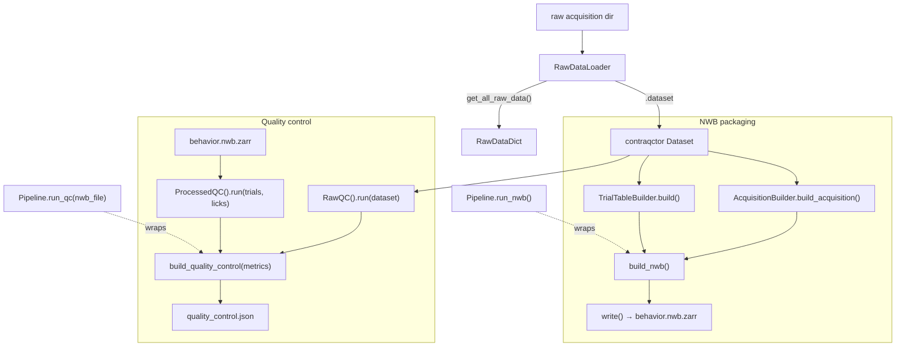

# Architecture

An overview of the `dynamic-foraging-processing` design: how it maps to the
low-level processing **reference diagram**, how the pieces compose, how to extend it,
and the rationale behind the design choices.

The alignment sections compare the reference diagram (the target design) with what
the repo currently implements, call out where they differ, and document the rationale
— doubling as a checklist for **updating the reference diagram to match the source
code** (each row/section flags what the diagram should be revised to reflect).

> The diagram is the intended low-level design (raw loader → process → package to
> NWB → QC from NWB). The repo tracks it closely; the differences below are mostly
> either deliberate simplifications, correctness-driven, or components still to be
> built.

## Scope
Delivered across 40+ tracked issues over roughly a four-week period. The work spans
several distinct areas:

- **Data engineering** — the contract loader, stream navigation, trials-table
  assembly, NWB packaging (Zarr, reserved-name collisions, `id` handling, JSON-safe
  serialization).
- **Domain / behavioral knowledge** — licks, rewards, side bias, and auto-reward
  semantics, including the meaning of each QC check.
- **API / architecture design** — the class-vs-function question, composable stages,
  and the `run_qc` reshaping; these were iterative design decisions rather than
  one-pass coding.
- **QC + schema** — `aind-data-schema`, `QualityControl` / `Processing`, and the
  raw-vs-processed split.
- **Release engineering** — semantic-release workflow, rulesets, bypass lists,
  `SERVICE_TOKEN`, branch protection, and the `dev` → `main` flow — a substantial
  area on its own.
- **Testing rigor** — 100% coverage and docstring gates on every change.
- **Documentation + stakeholder communication** — READMEs, capsule docs, and this
  divergence-rationale doc for review.
- **Organizational / coordination layer** — reconciling a reference
  diagram, scientist requirements, engineering requirements, backward-compatibility constraints, and reviewer
  feedback.

## TL;DR
- **Overall shape matches.** Loader → builders → package-to-NWB → QC-from-NWB, with
  `BaseQC` / `RawQC` / `ProcessedQC`, and `aind-nwb-utils` + `aind-data-schema` as
  the external writers. All present.
- **Biggest intentional gap:** the diagram's dedicated **`EventsBuilder` →
  `EventsTable`** stage is **deferred/blocked**. Per-event data (licks, reward
  deliveries) is carried as **acquisition time series** — both because that stage
  isn't built yet *and* because that form **maintains backward compatibility with the
  existing pipeline** (see §4).
- **Biggest structural difference:** the diagram models the two entry points as
  **free functions** (`build_df_nwb`, `qc_from_nwb_file`); the repo implements them
  as **`Pipeline` methods** (`run_nwb`, `run_qc`).
- **A necessary difference (and the `RawDataDict` is still present):** `RawQC`
  consumes the `contraqctor` **`Dataset`** (real contract QC), not the plain
  `RawDataDict` the diagram shows. The dict *is* available (`get_all_raw_data()`) —
  the builders (`TrialTableBuilder` included) just build from the `Dataset` because
  it's easier to navigate and access.

## Component-by-component alignment

| Diagram component | Current repo | Status |
| --- | --- | --- |
| `RawDataLoader` (`dfp.raw_data`) → `RawDataDict` | `raw_data_loader.RawDataLoader` → `get_all_raw_data()` dict (+ `.dataset`) | ✅ Aligned |
| `TrialsBuilder` (`dfp.process.trials`) → `TrialsTable` | `processing.TrialTableBuilder` → trials `DataFrame` | ✅ Aligned |
| `EventsBuilder` (`dfp.process.events`) → `EventsTable` | *(none — deferred/blocked)* | ⛔ Not yet built |
| `BaseQC` interface | `qc._core.BaseQC` | ✅ Aligned |
| `RawQC` (`dfp.qc.raw`) | `qc.raw.RawQC` | ✅ Aligned (different input — see below) |
| `ProcessedQC` (`dfp.qc.processed`) | `qc.processed.ProcessedQC` | ✅ Aligned (different input — see below) |
| `build_df_nwb` function (`dfp.package`) | `pipeline.Pipeline.run_nwb` | ◐ Same role, method vs function |
| `qc_from_nwb_file` function (`dfp.qc`) | `pipeline.Pipeline.run_qc` | ◐ Same role, method vs function |
| `NWBFile` (Zarr: acquisition / events / intervals) | NWB (Zarr): acquisition + `trials` (no separate events table) | ◐ Partial (events folded into acquisition) |
| `aind-nwb-utils` (base NWB) | `create_base_nwb_file` in `run_nwb` | ✅ Aligned |
| `aind-data-schema` `Processing` / `QualityControl` | `Processing` in `run_nwb`, `QualityControl` in `run_qc` | ✅ Aligned |
| *(implicit: raw streams written to acquisition)* | explicit `nwb.acquisition.AcquisitionBuilder` | ➕ Extra in repo |

## Composability & usage
Every stage is an independent, callable unit that works **directly off the
`RawDataLoader`** — the `Pipeline` object is optional convenience, not a requirement.
You can construct the builders and QC stages straight from the loader, grab any
single piece, run only raw QC or only processed QC, or assemble your own flow (the
example notebooks show this). One caveat: the builders and QC stages consume the
loader (or its `.dataset`), **not** the `RawDataDict` from `get_all_raw_data()`.



**Tier 1 — one-shot (the capsules).**
```python
from dynamic_foraging_processing.pipeline import Pipeline
from dynamic_foraging_processing.raw_data_loader import RawDataLoader

pipeline = Pipeline(RawDataLoader(path="/data/<acquisition>"))
pipeline.run_nwb("/results")                       # → behavior.nwb.zarr + processing.json
pipeline.run_qc(nwb_file, "/results")              # → quality_control.json (+ qc/ figures)
```

**Tier 2 — building blocks, straight off the loader (no `Pipeline` needed).**
```python
from dynamic_foraging_processing.raw_data_loader import RawDataLoader
from dynamic_foraging_processing.nwb.acquisition import AcquisitionBuilder
from dynamic_foraging_processing.processing import TrialTableBuilder

loader = RawDataLoader(path="/data/<acquisition>")
acquisition = AcquisitionBuilder(loader).build_acquisition()   # takes the loader
trials = TrialTableBuilder(loader.dataset).build()             # takes the dataset
```
(`Pipeline.build_acquisition()` / `build_trials()` are thin wrappers over exactly
these — use them if you already hold a `Pipeline`, or the classes directly if you
don't.)

**Tier 3 — QC à la carte (raw, processed, or both).**
```python
from dynamic_foraging_processing.qc import RawQC, ProcessedQC, build_quality_control

raw_metrics = RawQC().run(loader.dataset)                       # raw contract QC only
proc_metrics = ProcessedQC().run(trials, left_licks, right_licks)  # behavior QC only

# assemble whichever you want into one QualityControl:
qc = build_quality_control(raw_metrics)                          # raw only
qc = build_quality_control(proc_metrics)                         # processed only
qc = build_quality_control([*raw_metrics, *proc_metrics])        # both (what run_qc does)
```
(Lick-time arrays come from the NWB acquisition series, or `AcquisitionBuilder.get_lick_times(...)`.)

## Extending it (contribution points)
The composable layout gives contributors — scientists included — small, self-contained
places to plug in without touching the pipeline plumbing. Each has a defined home, a
clear path into the output, and a test to add.

### Add or adjust a trials-table column
**1. Declare it** — a field (with a `description`) on `TrialConfig`
(`processing/models/trial_config.py`). The `description` is the single source of truth:
`TrialConfig.column_descriptions()` feeds it into the NWB trials column, so there's no
NWB-side change to make.
```python
# processing/models/trial_config.py
class TrialConfig(BaseModel):
    ...
    reaction_time: Optional[float] = Field(
        default=None, description="Time (s) from go cue to the animal's first lick."
    )
```
**2. Populate it** — where each row is assembled, in `TrialTableBuilder._build_row`
(`processing/_trial_table.py`), from the per-trial inputs already in scope (outcome,
start/stop times, response, hardware streams).
```python
# processing/_trial_table.py — inside TrialTableBuilder._build_row(...)
return TrialConfig(
    ...,
    reaction_time=reaction_time,   # computed from the per-trial inputs in scope
)
```
**3. Test it** — under `tests/test_processing/`.
```python
def test_reaction_time_column(dataset):   # dataset: a test Dataset (see existing fixtures)
    trials = TrialTableBuilder(dataset).build()
    assert "reaction_time" in trials.columns
```

### Add a behavior (processed) QC check
**1. Write the check** — a function returning a `QCResult` in `qc/processed/behavior.py`,
alongside `side_bias_result` / `lick_interval_results`.
```python
from dynamic_foraging_processing.qc import QCResult

def finish_rate_result(trials) -> QCResult:
    """Fraction of trials the animal responded to (0/1 = left/right, 2 = no response)."""
    responded = float((trials["animal_response"] != 2).mean())
    return QCResult(
        name="finish rate",
        value=responded,
        passed=responded >= 0.5,
        description="Fraction of trials with a response.",
        tags={"behavior": "finish rate"},   # groups under "behavior" in the QC portal
    )
```
**2. Register it** — add its result to the list `behavior_qc_results` returns
(`qc/processed/results.py`). `ProcessedQC.run` converts that list to metrics, and
`build_quality_control` folds them into the combined `QualityControl` — no pipeline
change.
```python
# qc/processed/results.py — inside behavior_qc_results(...)
results = [
    side_bias_result(side_bias),
    finish_rate_result(trials),                                 # ← new check
    *lick_interval_results(left_lick_times, right_lick_times),
]
```
**3. (Optional) Figure** — add a plotter in `qc/processed/plots.py` and set the
result's `reference` to the filename so the QC portal resolves it.
```python
# qc/processed/plots.py
def plot_finish_rate(trials, results_folder):
    ...
    fig.savefig(Path(results_folder) / "finish_rate.png")
    return "finish_rate.png"
```
**4. Test it** — under `tests/test_qc/`.
```python
import pandas as pd

def test_finish_rate_result():
    trials = pd.DataFrame({"animal_response": [0, 1, 2, 1]})
    result = finish_rate_result(trials)
    assert result.value == 0.75
    assert result.passed
```

### Add a raw / contract QC check
Raw checks come from the upstream `aind-behavior-dynamic-foraging` **data-QC suite**;
`RawQC` runs and surfaces them via `contract_qc_metrics`. New contract checks are added
in that suite, not here — then they appear automatically:
```python
from dynamic_foraging_processing.qc import RawQC

metrics = RawQC().run(loader.dataset)   # includes whatever checks the suite defines
```

### Prototype in a notebook
Everything is callable off the loader — no pipeline or disk writes needed:
```python
from dynamic_foraging_processing.raw_data_loader import RawDataLoader
from dynamic_foraging_processing.processing import TrialTableBuilder
from dynamic_foraging_processing.qc.processed.behavior import finish_rate_result

loader = RawDataLoader(path="/data/<acquisition>")
trials = TrialTableBuilder(loader.dataset).build()
print(finish_rate_result(trials))       # try your new check inline
```

### Guardrails
Contributions must clear the repo's **100% test coverage and 100% docstring** gates
(`uv run coverage run -m pytest && uv run coverage report`; `uv run interrogate .`),
and inputs must be in the `aind-behavior-dynamic-foraging` data-contract format. These
keep quality high but are a learning curve for occasional contributors — worked
examples and small templates (e.g. "add a QC check", "add a trials column") would
lower the barrier further.

## Where the repo differs, and why

### 1. Entry points: class methods vs. free functions
- **Diagram:** `build_df_nwb(...)` and `qc_from_nwb_file(...)` are stand-alone functions.
- **Repo:** `Pipeline(loader).run_nwb(...)` and `.run_qc(nwb_file, ...)`.
- **Assessment — neutral / mild trade-off.** The `Pipeline` object holds the loader
  and per-session config (lick sources) once and exposes composable building blocks
  (`build_acquisition`, `build_trials`, `build_nwb`, `write`), which is convenient
  for notebooks and tests. The diagram's free functions are simpler for a capsule
  author (call one function). Both are fine; if the capsule surface ever feels
  heavy, thin `build_df_nwb` / `qc_from_nwb_file` wrappers around `Pipeline` would
  reconcile the two with no loss.

### 2. QC-from-NWB
- **Diagram:** `qc_from_nwb_file` reads the `NWBFile` and runs QC from it.
- **Repo:** `run_qc(nwb_file, ...)` takes the in-memory `NWBFile` and reads the
  trials table + lick times back from it; raw QC runs over the loader's dataset.
- **Assessment — aligned.** This matches the diagram's key idea (QC is driven by the
  packaged NWB, not by rebuilding from raw). The one nuance is that raw contract-QC
  still needs the raw dataset, so `run_qc` also relies on the loader — inherent, not
  a divergence.

### 3. `RawQC` input: `Dataset` vs `RawDataDict`
- **Diagram:** `RawQC.run(acquisition: RawDataDict)`.
- **Repo:** `RawQC.run(acquisition: contraqctor.Dataset)`.
- **Assessment — the `Dataset` is the required input here (and the dict still
  exists).** The `RawDataDict` is available via `get_all_raw_data()`; it simply isn't
  what `RawQC` consumes. Contract QC (Harp/camera/CSV/data-contract checks) is defined
  over the `contraqctor` `Dataset`, not a plain stream-name→DataFrame dict — a
  `RawDataDict` cannot support those checks — so `RawQC` takes the `Dataset`. See the
  Design decisions note on why the builders use the `Dataset` too.

### 4. Processed-events representation (the deferred `EventsBuilder`)
- **Diagram:** a first-class `EventsBuilder` → `EventsTable`, written into the NWB as
  a processed events container; `ProcessedQC` takes `(EventsTable, TrialsTable)`.
- **Repo (interim):** no events table. Per-event data lives as **acquisition time
  series** (`left/right_lick_time`, `left/right_reward_delivery_time`), and
  `ProcessedQC.run(trials, left_lick_times, right_lick_times, ...)` takes lick-time
  arrays rather than an `EventsTable`.
- **Assessment — deliberate (backward compatibility), plus an interim piece.** Two
  reasons the event data lives as acquisition series today: (1) the existing pipeline
  expects licks/rewards in that acquisition-series form, so keeping them there
  **maintains backward compatibility** with downstream consumers, and (2) the
  dedicated `EventsBuilder` → `EventsTable` stage is deferred. So this isn't purely a
  stopgap. A first-class `EventsTable` is still the more standard, queryable
  representation and would let `ProcessedQC` take a clean `(events, trials)` pair —
  but even once `EventsBuilder` lands, the acquisition series may need to **remain**
  (or be produced alongside the table) for backward compatibility. Treat the
  `EventsTable` as additive, not necessarily a straight replacement.

### 5. Explicit `AcquisitionBuilder`
- **Diagram:** raw streams are written straight into the NWB acquisition inside
  `build_df_nwb`; there is no separate acquisition builder.
- **Repo:** `nwb.acquisition.AcquisitionBuilder` is a distinct class that both
  packages every raw stream as a `DynamicTable` and derives the lick/reward series.
- **Assessment — required.** Packaging the raw streams into the NWB acquisition was
  an explicit **requirement from the scientist** (the raw data must travel in the
  NWB), so this stage is deliberate, not incidental. It is implemented as an explicit,
  unit-tested `AcquisitionBuilder` rather than inlined in the packaging function. Part
  of what it does (the derived event series) is the deferred `EventsBuilder`'s job;
  once that exists, `AcquisitionBuilder` narrows to "package raw streams," and still
  satisfies the requirement.

### 6. Module naming
- **Diagram:** `dfp.raw_data`, `dfp.process.events`, `dfp.process.trials`,
  `dfp.qc.raw`, `dfp.qc.processed`, `dfp.package`, `dfp.qc`.
- **Repo:** `raw_data_loader`, `nwb.acquisition`, `processing`, `qc.raw`,
  `qc.processed`, `pipeline`.
- **Assessment — naming only.** The QC layout matches; the rest is renamed. The repo
  has no `process.events` (deferred) and adds `nwb` + `pipeline` packages. No
  functional difference; renaming isn't necessary.

## Design decisions
Divergences from the diagram were deliberate; the reasoning is recorded here so it
lives with the code (not only in PR descriptions):

- **The `RawDataDict` exists — builders use the `Dataset` by choice.**
  `RawDataLoader.get_all_raw_data()` returns the `RawDataDict` the diagram shows, so
  that representation *is* present. The trials-table builder (and `RawQC`) instead
  consume the `contraqctor` `Dataset` because its lazy tree navigation
  (`dataset.at("Behavior").at("SoftwareEvents").at("TrialOutcome").load()`) and
  typed models make targeted stream access far easier than digging through a fully
  materialized dict. The dict stays available for any consumer that prefers it — this
  is a choice of convenience, not a missing piece.
- **Entry points are `Pipeline` methods, not free functions.** Considered mirroring
  the diagram's `build_df_nwb` / `qc_from_nwb_file` functions. Chose the class so everything is all in one place and the build steps stay
  composable for notebooks/tests. Thin free-function wrappers can be added later
  without breaking this.
- **`run_qc` combines raw + processed, but the two stages stay independently
  callable.** Weighed a processed-only, loader-free QC against a combined run; chose
  combined so a single `quality_control.json` carries both stages (the diagram's
  intent), accepting that the QC capsule needs both the raw asset and the NWB.
  Crucially the raw-vs-processed split already exists at the stage level: `RawQC`,
  `ProcessedQC`, and `build_quality_control` are callable and composable on their own
  (see **Composability & usage**). `run_qc` is just the convenience combiner.
- **`RawQC` consumes the `contraqctor` `Dataset`, not `RawDataDict`.** The diagram's
  dict can't support contract checks.
- **Raw data is packaged into the NWB acquisition** — an explicit requirement from
  the scientist, so it's required, not incidental (see §5).
- **Per-event data (licks/rewards) is kept as acquisition series** for two deliberate
  reasons: **backward compatibility with the existing pipeline** and the deferred
  `EventsBuilder` stage — not merely a stopgap (see §4).

## Recommendation
The repo follows the reference design's overall structure (loader → build →
package → QC-from-NWB, on `aind-nwb-utils` + `aind-data-schema`). Two deviations are
driven by constraints rather than preference: `RawQC` takes the `contraqctor`
`Dataset` because contract QC requires it, and the explicit, tested
`AcquisitionBuilder` satisfies the scientist's raw-data-in-acquisition requirement.
The one item to keep on the roadmap is the **`EventsBuilder`
→ `EventsTable`** stage: landing it is what closes the last real gap with the
diagram and lets `ProcessedQC` take a proper `(events, trials)` pair instead of
raw lick arrays. The class-vs-function entry-point difference is a stylistic choice
that can be bridged with thin function wrappers if/when the capsules want them.

## Process takeaway
Most of the divergences above trace to information that surfaced *during*
implementation rather than before the diagram was drawn — e.g. what the
`contraqctor` `Dataset` supports vs. a plain dict. Pinning down
**requirements (scientific + engineering) and the capabilities of the tools/libraries
up front — before finalizing the design diagram — would catch these earlier**,
reducing mid-build rework and review friction.

It's also genuinely hard to surface and explain each of these decisions *in the
moment*, while working across many interdependent components at once — so individual
divergences can look unexplained in the moment. This was delivered on a compressed
(~4-week) timeline, which compounds both effects: less room for requirements and tool
discovery up front, and less bandwidth to document rationale as the work happens.
Consolidating the rationale in one place after the fact (this doc), and running the
design phase of the software life cycle with fuller requirements and tool knowledge
up front, are the two improvements to carry forward. Treating the diagram as a living
artifact reconciled against the code (as this doc does) is part of the same fix.

## Changelog

### 0.1.0 — initial release
End-to-end pipeline that packages a raw dynamic foraging acquisition into NWB and runs
quality control. Delivered:

- **`RawDataLoader`** — raw streams via the `aind-behavior-dynamic-foraging` data
  contract (`get_all_raw_data()` plus the `contraqctor` `Dataset`).
- **`AcquisitionBuilder`** — NWB acquisition module: the four derived event series
  plus every raw contract stream as a `DynamicTable`.
- **`TrialTableBuilder` / `TrialConfig`** — NWB `trials` table, with `TrialConfig`
  field descriptions as the source of truth for the column descriptions.
- **`RawQC` / `ProcessedQC`** — contract QC and behavior QC assembled into one
  `aind-data-schema` `QualityControl` via `build_quality_control`.
- **`Pipeline`** — the two capsule entry points: `run_nwb` (writes
  `behavior.nwb.zarr` + `processing.json`) and `run_qc` (writes
  `quality_control.json` + figures).
- Release automation (semantic-version bump + tag on merge to `main`) and 100% test
  coverage / docstring gates.

Reasoning for the choices above — including the deferred `EventsBuilder`, the
`Dataset`-over-dict decision, and the backward-compatibility constraint — is in the
sections of this document (see **Design decisions** and **Where the repo differs, and
why**).

