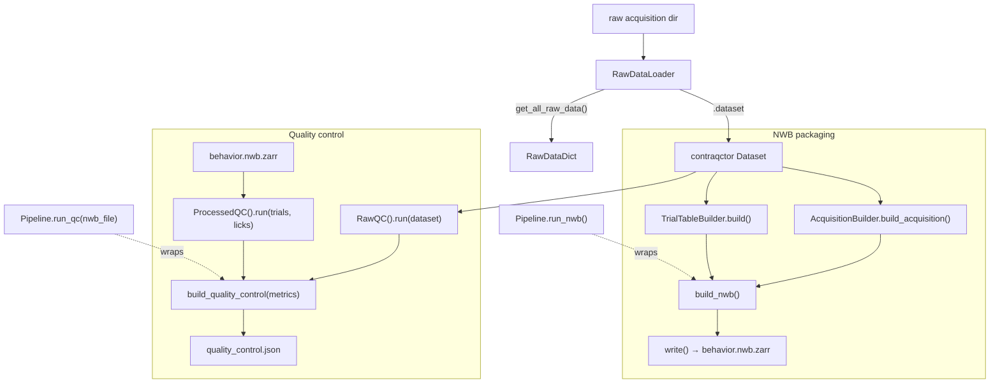

# Composability & usage

Back to the [architecture overview](../architecture.md).

Every stage is an independent, callable unit that works **directly off the
`RawDataLoader`** — the `Pipeline` object is optional convenience, not a requirement.
You can construct the builders and QC stages straight from the loader, grab any
single piece, run only raw QC or only processed QC, or assemble your own flow (the
example notebooks show this). One caveat: the builders and QC stages consume the
loader (or its `.dataset`), **not** the `RawDataDict` from `get_all_raw_data()`.



**Tier 1 — one-shot (the capsules).**
```python
from dynamic_foraging_processing.pipeline import Pipeline
from dynamic_foraging_processing.raw_data_loader import RawDataLoader

pipeline = Pipeline(RawDataLoader(path="/data/<acquisition>"))
pipeline.run_nwb("/results")                       # → behavior.nwb.zarr + processing.json
pipeline.run_qc(nwb_file, "/results")              # → quality_control.json (+ qc/ figures)
```

**Tier 2 — building blocks, straight off the loader (no `Pipeline` needed).**
```python
from dynamic_foraging_processing.raw_data_loader import RawDataLoader
from dynamic_foraging_processing.nwb.acquisition import AcquisitionBuilder
from dynamic_foraging_processing.processing import TrialTableBuilder

loader = RawDataLoader(path="/data/<acquisition>")
acquisition = AcquisitionBuilder(loader).build_acquisition()   # takes the loader
trials = TrialTableBuilder(loader.dataset).build()             # takes the dataset
```
(`Pipeline.build_acquisition()` / `build_trials()` are thin wrappers over exactly
these — use them if you already hold a `Pipeline`, or the classes directly if you
don't.)

**Tier 3 — QC à la carte (raw, processed, or both).**
```python
from dynamic_foraging_processing.qc import RawQC, ProcessedQC, build_quality_control

raw_metrics = RawQC().run(loader.dataset)                       # raw contract QC only
proc_metrics = ProcessedQC().run(trials, left_licks, right_licks)  # behavior QC only

# assemble whichever you want into one QualityControl:
qc = build_quality_control(raw_metrics)                          # raw only
qc = build_quality_control(proc_metrics)                         # processed only
qc = build_quality_control([*raw_metrics, *proc_metrics])        # both (what run_qc does)
```
(Lick-time arrays come from the NWB acquisition series, or `AcquisitionBuilder.get_lick_times(...)`.)
